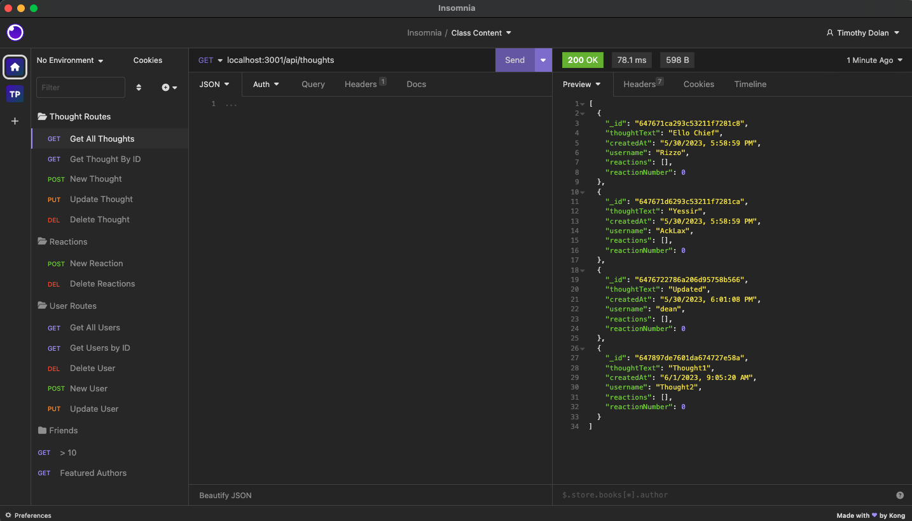

# Social Media API

## Github Repo
https://github.com/timdolan14/Social-Media-API

## Video Link
https://drive.google.com/file/d/1s9RuEtN-8ULwjF90iYWfzANW6pRaeYrV/view

## Description

This Social Network API is built using Node.js, Express, and utilizes Mongoose models to sync data with a MongoDB database. It provides a range of functionalities for interacting with a social network application, including adding and/or removing users, thoughts, reactions, and friends of a User. Node.js, Mongoose, and MongoDB work together to ensure smooth data management, with Node.js delivering high performance and Mongoose enhancing flexibility and integrity. MongoDB's data model allows for scalability and easy data modification, making it an ideal choice for storing social network data.

## Usage
To review this Site Creation, you can review the notes in each section. Open the Chrome DevTools by pressing Command+Option+I (macOS) or Control+Shift+I (Windows). A console panel should open either below or to the side of the webpage in the browser.

## Credits
N/A

## License
N/A